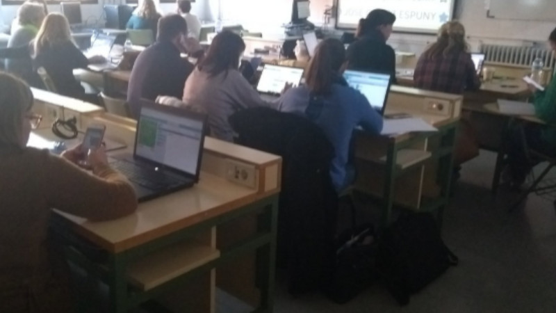
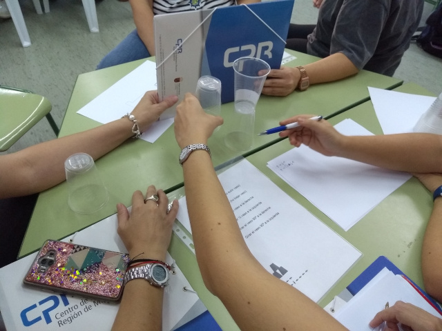
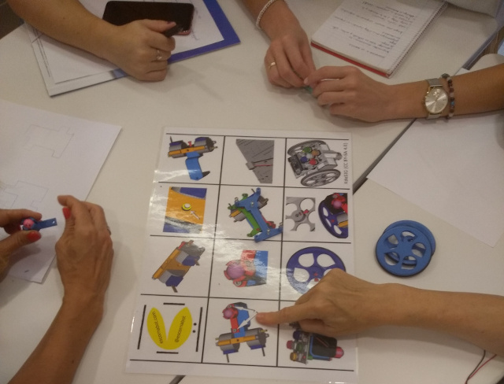
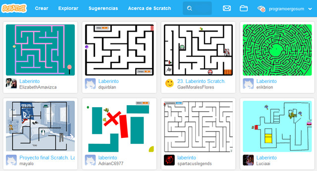
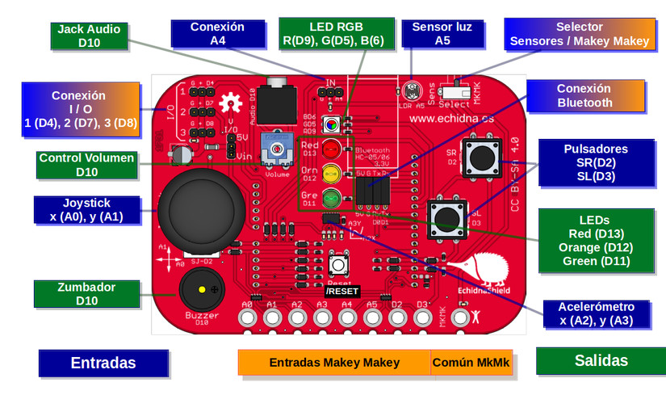

## Introducción

El curso surge ante la necesidad de dotar a los centros de recursos pedagógicos para el uso de robots en las aulas. Se trata de fomentar la innovación docente mediante nuevas herramientas que puedan despertar el interés de los alumnos por las nuevas tecnologías.

Esta actividad, catalogada de nivel A2 permite adquirir y/o desarrollar las siguientes áreas competenciales dentro del **Marco Común de la Competencia Digital Docente**.

- Área 1: Información y alfabetización informacional
  - 1.1. Navegación, búsqueda y filtrado de información, datos y contenidos digitales
  - 1.2. Evaluación de la información, datos y contenidos digitales
- Área 2: Comunicación y colaboración
  - 2.2. Compartir información y contenidos digitales
  - 2.4. Colaboración mediante canales digitales
- Área 3: Creación de contenido digital
  - 3.4. Programación
- Área 5: Resolución de problemas
  - 5.2. Identificación de necesidades y respuestas tecnológicas.

### Objetivos del curso

1. Analizar los entornos de *programación y lenguajes*.
2. Utilizar técnicas de *gamificación* en el aula.
3. Conocer las posibilidades que ofrece la *realidad aumentada*.
4. Explorar técnicas utilizando *robots educativos*.
5. Introducción al mundo DIY y *maker* en educación.

 

## Programar sin ordenador

Actualmente podemos encontrar numerosas actividades para aprender a programar sin ordenador, lo que se conoce como *programación desenchufada o desconectada*.

Este tipo de actividades desconectadas son ideales para ir adquiriendo ciertas destrezas en el mundo de la programación informática además de ser beneficiosas para el desarrollo del pensamiento computacional, donde los alumnos descubren las respuestas a los problemas por sí mismos fomentando un enfoque constructivista, en vez de darles una solución al problema. 

Pero lo más importante es que estas actividades suelen ser de bajo coste al usar materiales encontrados en las aulas.

#### Enlaces de interés

- <a target="_blank" href="https://classic.csunplugged.org/books/">Libro en PDF de actividades de programación sin ordenador</a>
- <a target="_blank" href="https://www.programoergosum.es/blog/aprender-a-programar-sin-ordenador/">Ejemplos de actividades para aprender a programar sin ordenador</a>

 

## Robots de suelo

Aunque el robot de suelo más conocido es la famosa abeja Beebot, podemos encontrar otros robots. En este curso presencial de introducción a la robótica desde etapas de educación infantil, se ha utilizado el robot <a target="_blank" href="http://escornabot.com">Escornabot</a> por todas las ventajas que conlleva sobre otros robots educativos.

### ¿Qué es Escornabot?

Escornabot es un proyecto de robot educativo para iniciarse en el campo de la robótica y la programación que puede ejecutar secuencias de movimientos que son programadas por el usuario mediante la pulsación de botones del robot o introduciendo comandos en un dispositivo móvil con conexión Bluetooth. Similar a otros robots de suelo como Beebot, Next, etc. lo que hace especial a Escornabot es la filosofía que sigue de proyecto de código y hardware abierto.

Aunque nace en la asociación de makers  (Galicia), son muchos los que aportan y difunden el proyecto para que más niños y niñas sientan interés por la programación y la robótica desde cero, uno de ellos es <a target="_blank" href="https://pablorubma.cc/escornabot/">Pablo Rubio</a>.

 

## Impresión 3D

La impresión 3D está empezando a verse y utilizarse en los centros educativos. Es así porque profesores se han dado cuenta del valor de la impresora 3D como una herramienta para enseñar a la próxima generación de inventores.

Aunque parezca cosa solo de ingenieros, existe multitud de software preparado para utilizarse con jóvenes, como es el caso de <a target="_blank" href="https://www.tinkercad.com/">TinkerCAD</a>.

El objetivo de usar TinkerCAD para iniciarse en el mundo de la impresión 3D es debido a su sencillez para realizar cualquier objeto en 3D arrastrando bloques y sin necesidad de utilizar funciones complejas como en programas más avanzados de diseño 3D.

> Puedes acceder al <a target="_blank" href="https://www.programoergosum.com/cursos-online/impresion-3d/902-introduccion-a-tinkercad/introduccion">tutorial</a> de iniciación a Tinkercad de esta misma plataforma.

Como se puede observar, TinkerCAD es sencillo de usar, atractivo y con unas pocas horas de entrenamiento podemos adquirir mucha destreza en su uso. Como desventaja podríamos decir que es necesario tener una cuenta de correo para darse de alta como usuario y que sólo posee una versión online.

 

## Programación con bloques

Un lenguaje de programación por bloques tiene como característica principal centrarse en el desarrollo de habilidades mentales mediante el aprendizaje de la programación, sin tener conocimientos sobre el código escrito. Sus características están ligadas al fácil entendimiento del pensamiento lógico y computacional han hecho que sea muy difundido en la educación desde edades iniciales.

Estos lenguajes de programación se utiliza con fines didácticos para crear animaciones de forma sencilla y servir como introducción al contenido de programación más avanzado. Entre los principales lenguajes de programación por bloques tenemos a Scratch, Blockly o Snap.

> Accede a nuestros <a target="_blank" href="https://www.programoergosum.com/cursos-online/scratch">tutoriales</a> para aprender a programar con Scratch.

 

## Echidna Shield

Echidna Shield es un escudo para Arduino UNO de código abierto dirigido a facilitar el aprendizaje de la programación, electrónica y robótica en los últimos cursos de educación primaria y secundaria.

Dispone de varios sensores integrados por lo cual no necesitaremos disponer de conocimientos en electrónica. Puede actuar en dos modos, un modo de sensores, donde podrás utilizar los sensores de la placa, y un modo Makey-Makey.

> Accede a nuestro <a target="_blank" href="https://www.programoergosum.com/cursos-online/robotica-educativa/604-robotica-educativa-con-echidna-shield/introduccion">tutorial</a> de primeros pasos con Echidna Shield para configurarla utilizando mBlock o Snap4Arduino.

 

## Materiales

- <a target="_blank" href="https://classic.csunplugged.org/books/">Libro de actividades de programación sin ordenador</a>

 

## Enlaces de interés

- <a href="https://www.programoergosum.es/blog/pensamiento-computacional-con-scratch/">Pensamiento computacional con Scratch</a>.
- <a href="https://www.programoergosum.es/blog/aprender-a-programar-sin-ordenador/">Aprender a programar sin ordenador</a>.
- <a target="_blank" href="https://www.programoergosum.com/cursos-online/scratch">Tutoriales de programación con Scratch</a>
- <a target="_blank" href="https://www.programoergosum.com/cursos-online/robotica-educativa">Tutoriales de Robótica Educativa</a>
- <a target="_blank" href="https://www.programoergosum.com/cursos-online/impresion-3d">Tutoriales de Impresión 3D</a>
- <a target="_blank" href="https://www.aprendeprogramando.es/cursos-online/blockly">Aprende a programar en Blockly</a>
