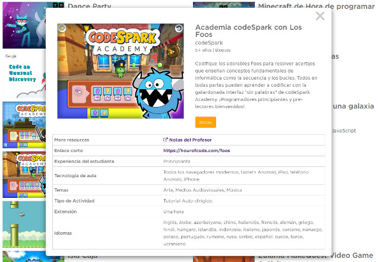

## Introducción

El curso surge ante la necesidad de dotar a los centros de recursos pedagógicos para el uso de robots en las aulas. Se trata de fomentar la innovación docente mediante nuevas herramientas que puedan despertar el interés de los alumnos por las nuevas tecnologías.

### Competencias profesionales

Esta actividad, catalogada de nivel A2 permite adquirir y/o desarrollar las siguientes áreas competenciales dentro del *Marco Común de la Competencia Digital Docente*.

- Área 1: Información y alfabetización informacional
  - 1.1. Navegación, búsqueda y filtrado de información, datos y contenidos digitales
  - 1.2. Evaluación de la información, datos y contenidos digitales
- Área 2: Comunicación y colaboración
  - 2.2. Compartir información y contenidos digitales
  - 2.4. Colaboración mediante canales digitales
- Área 3: Creación de contenido digital
  - 3.4. Programación
- Área 5: Resolución de problemas
  - 5.2. Identificación de necesidades y respuestas tecnológicas.

### Objetivos del curso

1. Analizar los entornos de *programación y lenguajes*.
2. Utilizar técnicas de *gamificación* en el aula.
3. Conocer las posibilidades que ofrece la *realidad aumentada*.
4. Explorar técnicas utilizando *robots educativos*.
5. Introducción al mundo DIY y *maker* en educación.

 

## Programar sin ordenador

Son numerosas las páginas, programas o robots pensados para el desarrollo del pensamiento computacional desde edades tempranas. Sin embargo, también podemos encontrar actividades para aprender a programar sin necesidad de utilizar un ordenador o dispositivo informático, lo que se conoce como *programación desenchufada o desconectada*.

> Accede al artículo donde explicamos algunas actividades para [aprender a programar sin ordenador](https://www.programoergosum.es/blog/aprender-a-programar-sin-ordenador/).

Durante esta sesión del curso, destinada a la **introducción al pensamiento computacional**, probamos diferentes actividades relacionadas con el aprendizaje de la programación, utilizando material comúnmente encontrado en las aulas de educación infantil y primaria.

Este tipo de actividades desconectadas son ideales para ir adquiriendo ciertas destrezas en el mundo de la programación informática y la robótica educativa ya que los alumnos descubren las respuestas a los problemas por sí mismos fomentando un enfoque constructivista.

Además, con un poco de imaginación se pueden crear diferentes juegos educativos para fomentar la lógica computacional. Juegos basados en programas como Scratch Jr. creado utilizando piezas impresas en 3D pero que perfectamente podrían haber sido creadas utilizando otro tipo de materiales como cartón pluma o goma eva entre otros muchos materiales.

 

## Robots educativos de suelo

Aunque el robot educativo de suelo más conocido suele ser la famosa abeja *Beebot*, podemos encontrar otros robots de características muy similares para utilizar en el aula con nuestros alumnos, como es el caso de *Next*, *Mouse* o el proyecto *Escornabot*, entre muchos otros.

> Accede al artículo donde realizamos una comparativa sobre los diferentes [robots educativos de suelo](https://www.programoergosum.es/blog/robots-educativos-de-suelo/).

Durante esta sesión del curso, destinada a la **introducción al pensamiento computacional**, probamos diferentes robots educativos para que sean los propios docentes los que las tomen conclusiones de primera mano.

En nuestro caso, el robot de suelo que más nos gusta y sobre todo recomendamos, es el *Escornabot*. Lo que lo hace especial es la filosofía de proyecto de código y hardware abierto que sigue, además de la ámplia comunidad educativa que puedes encontrar en sus redes sociales.

Como prodrás observar, este robot no suele encontrarse en tiendas ya que el objetivo del proyecto es que seas tú mismo el que lo construye y lo monta comprando los materiales de electrónica e imprimiendo los modelos de las piezas con una impresora 3D.

En este curso los docentes aprenden las partes principales del robot Escornabot en su versión [2.12 Xdesig](https://www.thingiverse.com/thing:3269696) al mismo tiempo que lo montan.

 

## La Hora del Código

La Hora del Código es una iniciativa que tiene como objetivo incentivar a los estudiantes a aprender sobre las Ciencias Computacionales. Es una de las iniciativas preferidas por muchos de los docentes interesados en introducir la programación en el aula ya que disponene de numerosos materiales con asistentes interactivos para un aprendizaje guiado.

Podemos acceder al apartado de [actividades](https://hourofcode.com/es/learn) donde encontraremos una gran cantidad de proyectos educativos destinados a la enseñanza de la programación en las escuelas e institutos. Como se puede observr en la siguiente imagen, en cada una de las actividades aparece el nombre del proyecto, una pequeña descripción, y lo más importante, la edad recomendada de la actividad.

Durante esta sesión del curso, destinada a la **introducción a los lenguajes de programación**, probamos diferentes actividades de La Hora del Código para que sean los propios maestros y maestras los que puedan sacar conclusiones sobre su uso e implementación dentro del aula.

Las principales actividades probadas han sido las siguientes:

- [Lightbot](https://lightbot.com/hour-of-code.html)

 

## Plataforma Code.org

Esta plataforma es perfecta para aprender la lógica de la programación a través de los lenguajes de programación por bloques. Con sus asistente guiado no es necesario tener conocimientos con lo que se puede utilizar en el aula desde educación infantil. Además, cada curso viene acompañado de una documentación muy completa para el profesor con soluciones a los ejercicios.

Dentro de la Hora del Código se pueden encontrar numerosos proyectos educativos con el mismo objetivo de acercar la programación desde edades tempranas y para todos los niveles.

 

## Movimiento maker e Impresión 3D

La impresión 3D está empezando a utilizarse en los centros educativos. Es así porque profesores se han dado cuenta del valor de la impresora 3D como una herramienta para enseñar a la próxima generación de inventores.

Aunque parezca cosa solo de ingenieros, son muchos los tipos de impresoras que podemos encontrar para iniciarse en este maravilloso mundo del movimiento maker en educación. Una de las más conocidas en el ámbito educativo es la impresora *Da Vinci* por su sencillez en el uso así como por su precio. Aunque hay quienes prefieren hacerse con una impresora más profesional y potente para sacarle el máximo partido.

> Antes de comprar una impresora es buena idea hacer una comparativa en lo que se necesita.

Por otro lado, en cuanto al software utilizado, podemos diseñar piezas con programas preparados para utilizarse con jóvenes, como es el caso de [TinkerCAD](https://www.tinkercad.com/).

> Puedes acceder al [tutorial](https://www.programoergosum.com/cursos-online/impresion-3d/902-introduccion-a-tinkercad/introduccion) de iniciación a Tinkercad de esta misma plataforma.

El objetivo de usar TinkerCAD para iniciarse en el mundo de la impresión 3D es debido a su sencillez para realizar cualquier objeto en 3D arrastrando bloques y sin necesidad de utilizar funciones complejas como en programas más avanzados de diseño 3D.

 

## Programación con bloques

Un lenguaje de programación por bloques tiene como característica principal centrarse en el desarrollo de habilidades mentales mediante el aprendizaje de la programación, sin tener conocimientos sobre el código escrito. Sus características están ligadas al fácil entendimiento del pensamiento lógico y computacional han hecho que sea muy difundido en la educación desde edades iniciales.

Estos lenguajes de programación se utiliza con fines didácticos para crear animaciones de forma sencilla y servir como introducción al contenido de programación más avanzado. Entre los principales lenguajes de programación por bloques tenemos a Scratch, Blockly o Snap.

> Accede a nuestros [tutoriales](https://www.programoergosum.com/cursos-online/scratch) para aprender a programar con Scratch.

 

## Echidna Shield

Echidna Shield es un escudo para Arduino UNO de código abierto dirigido a facilitar el aprendizaje de la programación, electrónica y robótica en los últimos cursos de educación primaria y secundaria.

Dispone de varios sensores integrados por lo cual no necesitaremos disponer de conocimientos en electrónica. Puede actuar en dos modos, un modo de sensores, donde podrás utilizar los sensores de la placa, y un modo Makey-Makey.

> Accede a nuestro [tutorial](https://www.programoergosum.com/cursos-online/robotica-educativa/604-robotica-educativa-con-echidna-shield/introduccion) de primeros pasos con Echidna Shield para configurarla utilizando mBlock o Snap4Arduino.
