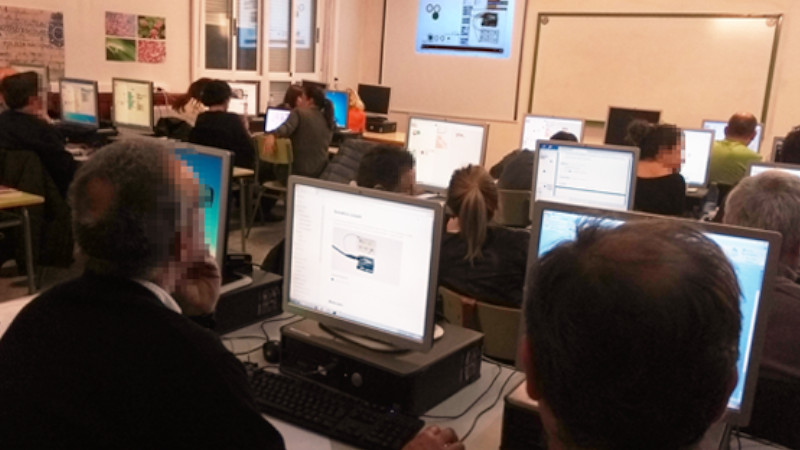
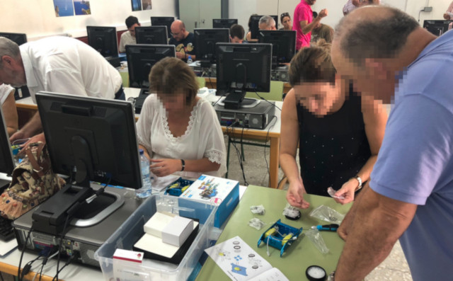
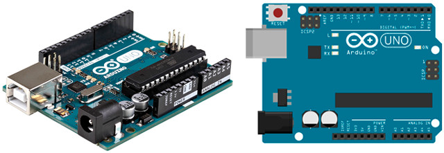
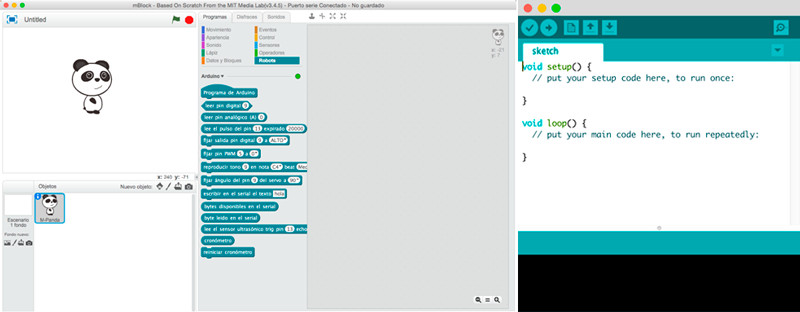

## Introducción

El siguiente curso presencial surge por la necesidad de dotar de recursos pedagógicos para la programación y el uso de robots en las aulas. Se trata de fomentar la innovación docente mediante nuevas herramientas que puedan despertar el interés de los jóvenes por la tecnología.

### Objetivos del curso

1. Analizar los entornos y lenguajes de programación por bloques.
2. Conocer mecanismos y técnicas de montaje de dispositivos electrónicos.
3. Explorar algunas posibilidades medioambientales, sensores y actuadores.
4. Estudiar equipos automáticos con Arduino.
5. Elaborar un proyecto educativo mediante la programación y electrónica con Arduino

<!--
 

## Diapositivas del curso

A continuación aparecen las diapositivas utilizadas en el curso. Puedes hacer clic en la diapositiva y desplazarte sobre ellas utilizando las flechas del teclado.

  <iframe src="https://wikitic.github.io/iniciacion-a-la-robotica-en-educacion-secundaria" allowfullscreen></iframe>

-->

 

## Lenguajes de programación

La aplicación de los lenguajes de programación por bloques permite una presentación visual del paradigma y metodología de la programación informática permitiendo centrarse en la lógica de la programación dejando a un lado la sintaxis propia de los lenguajes de programación (puntos y comas, paréntesis, etc).

### Plataforma Code.org (Sección alumnos)

Un buen comienzo en el aprendizaje de la programación es la plataforma Code.org. En ella se aprenden los conceptos de la programación a través de su asistente guiado paso a paso.

Los ejercicios a realizar en el <a target="_blank" href="https://studio.code.org/s/20-hour">curso acelerado</a> pueden ser los siguientes:

- Etapa 2: 1, 2, 3, 6, 8, 9, 12, 14, 17, 18, 20
- Etapa 9: 1, 2, 3, 4, 5, 6, 9, 10, 11
- Etapa 13: 1 (16 bloques), 2, 3, 4, 6, 7, 8, 9, 10 (26 bloques)
- Etapa 17: 1, 3, 5, 7, 8

### Plataforma Code.org (Sección docentes)

Esta herramienta es la preferida por muchos de los docentes interesados en introducir la programación en el aula ya que gracias a su asistente interactivo proporciona a los alumnos un aprendizaje guiado y cada uno puede programar a su ritmo. Además, el profesor puede desempeñar el rol de mentor para guiar a sus alumnos en los pasos de la programación. Es interesante crear una cuenta como profesor y administrar el aula con los alumnos, así puedes ver en tiempo real el progreso de los mismos y ver los ejercicios realizados, los ejercicios en los cuales tienen dudas, etc.

Para crear una cuenta como educador o profesor, seguiremos los siguiente pasos:

1. Acceder a la web de code.org y proceder al registro como profesor.
2. Registra una nueva sección o clase.
3. Registra a los alumnos. El registro de los alumnos en Code.org puede hacerse de un total de tres maneras; Por imagen: el profesor elige los nombres de usuario y el sistema asigna una imagen de entre un catálogo reducido para acceder a la plataforma. Por palabra: similar al de la imagen, pero con una palabra como contraseña en vez de un dibujo o imagen. Por correo electrónico: los alumnos tendrán que registrarse con su propio correo electrónico, y luego el profesor dará acceso a las respectivas cuentas registradas con determinadas direcciones.
4. Imprimir las tarjetas de los alumnos y entregarlas para que accedan siguiendo los pasos indicados en las mismas.

")

### VideoJuegos con Scratch

Una vez adquiridos los conocimientos necesarios sobre el lenguaje de bloques, se puede realizar un videojuego sencillo con Scratch para explicar las diferentes partes de la herramienta; escenario, bloques de programación, editor de programación, etc.

> Accede a nuestros <a target="_blank" href="https://www.programoergosum.com/cursos-online/scratch">tutoriales</a> para aprender a programar con Scratch.

Aparentemente el videojuego parece muy sencillo pero no lo es tanto, ya que antes de "arrastrar" cada bloques, se pedía explicar porqué se arrastra ese bloque y no otro. Además, se han realizado varias programaciones diferentes para realizar el mismo videojuego.

El ejemplo más claro de las distintas programaciones se ve en el desplazamiento del personaje principal. En primer lugar se realizó mediante eventos para entender la lógica de la programación. Más tarde se cambió introduciendo el concepto de paralelismo en la programación informática. 

También tenemos el ejemplo de clones en Scratch y cómo utilizarlos. Es el caso de las pelotas que aparecen con ángulos aleatorios cada 10 segundos y desaparecen cada 20 segundos, y solamente tenemos un objeto pelota, con diferentes disfraces.

Con Scratch se puede explicar el paradigma de la <a href="https://www.programoergosum.es/blog/programacion-orientada-a-objetos-con-scratch/">programación orientada a objetos</a> programando un videojuego muy sencillo.

### Plataforma Aprende Programando

Aprende Programando es un proyecto educativo destinado a cualquier persona que quiera adentrarse en el mundo de la programación informática de una forma diferente. Consiste en un asistente guiado para aprender a programar en diferentes lenguajes de programación Blockly, Python o JavaScript, al mismo tiempo que se proponen retos de matemáticas, física y tecnología.

Con el proyecto se pretende utilizar la programación de forma transversal hacia las STEM (Science, Technology, Engineering y Mathematics).

> Para el aprendizaje de las STEM a través de la programación puedes utilizar la plataforma <a target="_blank" href="https://www.aprendeprogramando.es">Aprende Programando</a>.

 

## Robótica educativa con mBot

El robot educativo mBot ha sido desarrolado para iniciarse en la programación y robótica desde educación primaria. Está basado en Arduino Uno considerándose sencillo de utilizar ya que no necesita cableado ni soldaduras gracias a sus conectores RJ25 (típicas conexiones de teléfono).

Una vez adquirido el robot mBot lo primero que tienes que hacer es montarlo siguiendo las instrucciones del fabricante. Estos pasos son muy sencillos. 

A continuación puedes realizar diferentes actividades para interactuar con los diferentes sensores y actuadores del robot.

> Accede a nuestros <a target="_blank" href="https://www.programoergosum.com/cursos-online/robotica-educativa">tutoriales</a> para aprender a programar el robot mBot.

 

## Introducción a Arduino

Arduino es una plataforma para prototipado de electrónica basada en hardware y software libre y fácil de utilizar. Podemos construir circuitos electrónicos y programarlos para iniciarnos en el mundo de la electrónica y robótica, construir componentes electrónicos a nuestro antojo e incluso crear un modelo de negocio.

### Hardware de Arduino

El microcontrolador de Arduino es un circuito integrado programable capaz de realizar operaciones matemáticas complejas a gran velocidad. Normalmente el modo de alimentación de una placa de Arduino es mediante el puerto USB mientras se está programando, pero hay ocasiones en la que necesitamos que el código de nuestra placa se siga ejecutándose sin estar conectado al equipo. Probablemente la forma más habitual de alimentar Arduino (sin utilizar tu equipo) es mediante una fuente de alimentación o pila de 9V.

Arduino dispone de un regulador de voltaje interno que actúa para que la tensión de alimentación no supere los 12V, ya que en caso contrario podemos dañar el regulador y con ello la placa de Arduino. Por otro lado, para tensiones inferiores a 7V en la alimentación, es probable que la placa no llegue a encenderse. La mayoría de los componentes electrónicos de Arduino utilizan una tensión operativa de 5V (ya regulada por el regulador de voltaje de la propia placa de Arduino)

### Software de Arduino

Para programar una tarjeta de Arduino, podemos utilizar diferentes lenguajes y entornos de programación. En este caso vamos a introducir la programación y electrónica con Arduino utilizando los lenguajes de programación por bloques y lenguajes de programación en modo texto.

 

## El Cable Amarillo

El Cable Amarillo es un proyecto educativo de código abierto para fomentar el uso de la programación y robótica en los centros educativos utilizando herramientas de software y hardware libre.

> Accede a las <a target="_blank" href="https://www.elcableamarillo.cc">prácticas</a> desde la web de El cable Amarillo.
