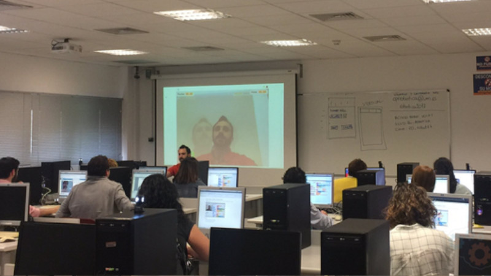
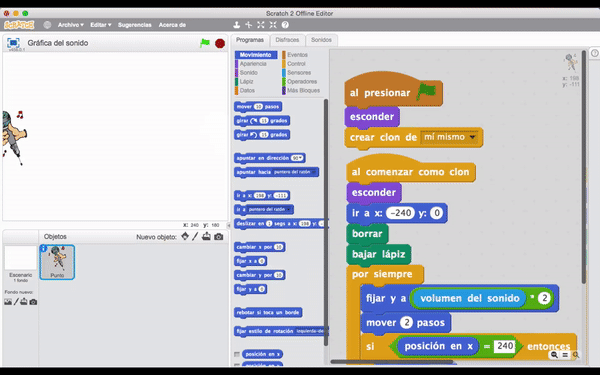
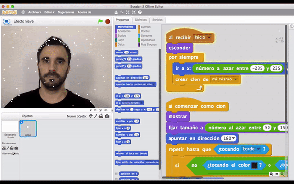

## Introducción

Durante las jornadas sobre programación y robótica en Murcia (destinadas a profesorado de la Consejería de Educación de la Región de Murcia), realizamos diferentes talleres tanto para maestros y maestras de educación infantil y primaria, como a profesorado de educación secundaria y bachillerato.

### Taller de Realidad Aumentada

El taller de realidad aumentada está destinado principalmente a maestros y maestras de educación infantil y primaria. El objetivo consiste en introducir el lenguaje de programación por bloques Scratch como aplicación en el aula.

### Taller de Internet de las Cosas

El taller de internet de las cosas está destinado principalmente a profesores de educación secundaria. El objetivo consiste en introducir los lenguajes de programación textuales como Python y el uso de la Raspberry Pi como aplicación en el aula.

 

## Medidor de volumen

Esta aplicación educativa tiene como finalidad medir el volumen de los alumnos con ayuda de un micrófono y mostrar diferentes imágenes por la pantalla. Por ejemplo, si el volumen es adecuado se mostrará un fondo de color verde con una cara sonriente. Si por el contrario aumenta el volumen, cambiará a un fondo amarillo mostrando una imagen diferente. Por último, si el volumen es excesivo, cambiará al fondo de color rojo mostrando una cara de enfado.

> Accede a nuestro [tutorial](https://www.programoergosum.com/cursos-online/realidad-aumentada/225-realidad-aumentada-y-control-de-volumen-con-scratch/introduccion) de control de volumen con scratch y realidad aumentada.

 

## Gráfica del sonido

Esta aplicación educativa tiene como finalidad similar a la anterior y puede utilizarse también en el aula de secundaria. 

En este caso se reproduce una gráfica a medida que aumenta o disminuye el volumen de la clase.

> Accede a nuestro [tutorial](https://www.programoergosum.com/cursos-online/realidad-aumentada/227-graficas-de-audio-con-realidad-aumentada-y-scratch/introduccion) de gráficas del sonido con scratch y realidad aumentada.

 

## Comida saludable

Esta aplicación educativa tiene como finalidad realizar un pequeño videojuego donde aparecen diferentes tipos de comida y tenemos que elegir la comida saludable. Para ello simplemente debemos pasar la mano por encima para capturarla. Conseguiremos puntos si capturamos la comida saludable, y por el contrario perderemos vidas si elegimos otro tipo de comida.

> Accede al [tutorial](https://www.programoergosum.com/cursos-online/realidad-aumentada/167-pokemon-go-programado-con-scratch-y-realidad-aumentada/introduccion) de pokemon con scratch y realidad aumentada de esta misma plataforma.

 

## Efecto nieve

Esta aplicación educativa tiene como finalidad simular el efecto de nieve sobre nuestra cabeza. Es decir, aparecerán copos de nieves que caen situándose sobre nuestro pelo y hombros. Además, se programa un algoritmo para que cuando nos movamos desaparezca la nieve con un efecto realista.

> Accede a nuestro [tutorial](https://www.programoergosum.com/cursos-online/realidad-aumentada/150-efecto-nieve-utilizando-realidad-aumentada-y-scratch/introduccion) de efecto nieve con scratch y realidad aumentada.

 

## Internet de las cosas

Esta aplicación tiene como finalidad adentrarse en el mundo del Internet de las Cosas (IoT) a través de una Raspberry Pi y utilizando Python como lenguaje de programación.

> Accede a nuestros [tutoriales](https://www.programoergosum.com/cursos-online/raspberry-pi) de programación sobre Raspberry Pi.
