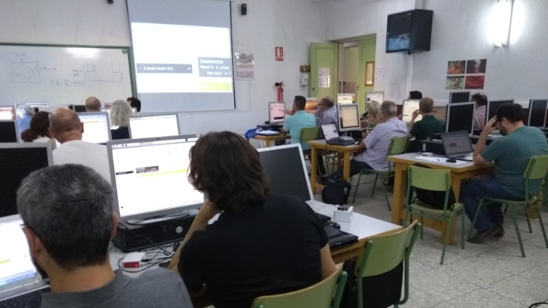
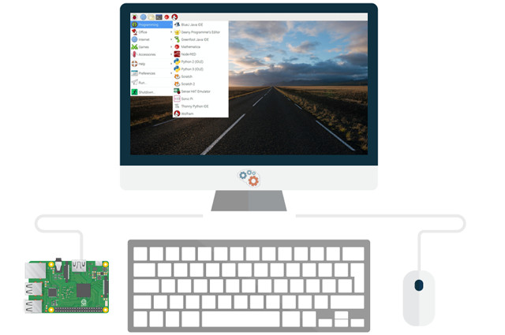
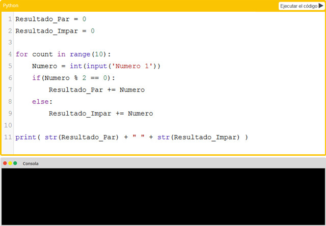
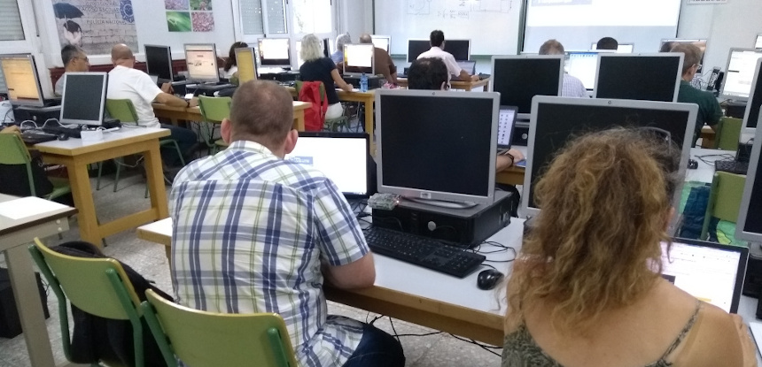
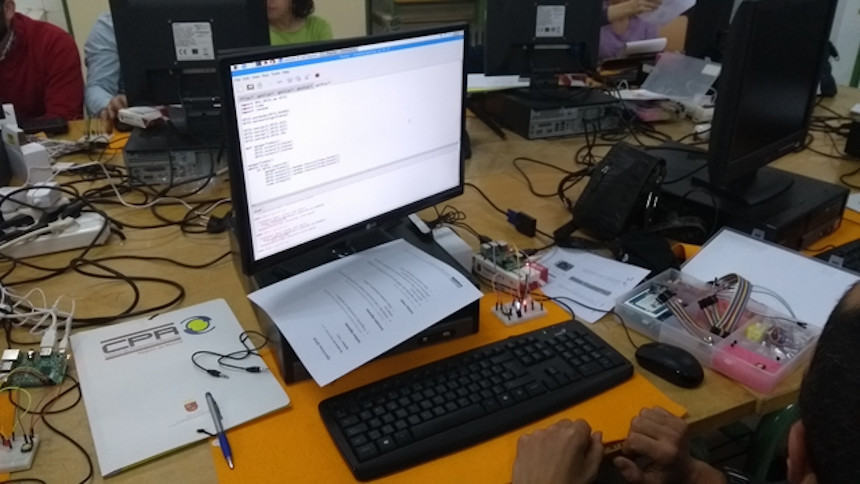
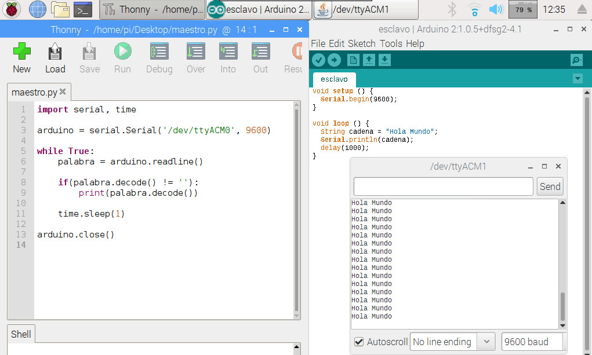
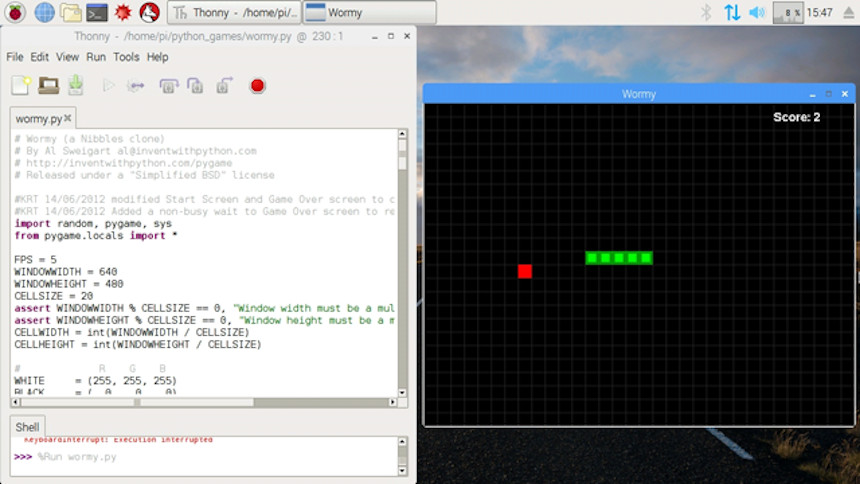
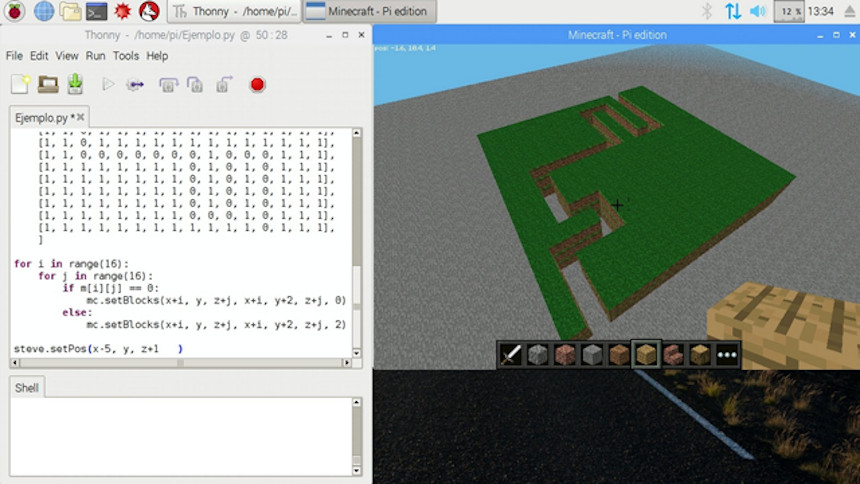

## Introducción

El siguiente curso presencial surge por la necesidad de aplicar lenguajes de programación textual como evolución a los lenguajes de programación por bloques realizados en cursos de iniciación.

### Competencias profesionales

Esta actividad, catalogada de nivel A2 permite adquirir y/o desarrollar las siguientes áreas competenciales dentro del *Marco Común de la Competencia Digital Docente*.

- Área 1: Información y alfabetización informacional
  - 1.1. Navegación, búsqueda y filtrado de información, datos y contenidos digitales
  - 1.2. Evaluación de la información, datos y contenidos digitales
- Área 2: Comunicación y colaboración
  - 2.2. Compartir información y contenidos digitales
  - 2.4. Colaboración mediante canales digitales
- Área 3: Creación de contenido digital
  - 3.1. Desarrollo de contenidos digitales
  - 3.2. Integración y reelaboración de contenidos digitales
  - 3.4. Programación
- Área 5: Resolución de problemas
  - 5.3. Innovación y uso de la tecnología digital de forma creativa

### Objetivos del curso

1. Posibles usos de la *Raspberry Pi* en el aula.
2. Aprender a programar en el lenguaje de programación *Python*.
3. Conocer el mundo digital y físico con la *Raspberry Pi*.
4. Introducción a la *domótica* e *Internet de las Cosas*.

 

## Introducción a Raspberry Pi

Raspberry Pi es un pequeño ordenador destinado principalmente a estimular la enseñanza de las ciencias de la computación en los centros educativos. La ventaja principal que se puede destacar sobre un ordenador convencional es la posibilidad de utilizar los pines GPIO para conectar el mundo físico con el mundo digital.

> Este curso se puede realizar con diferentes versiones de Raspberry Pi (2, 3 y 4).

El sistema operativo elegido y recomendado es Raspbian al estar optimizado para el procesador ARM (frente a los procesadores x86 que podemos encontrar en los PC de un aula convencional). Para más información sobre la arquitectura del procesador y modos de instalación accede al curso de instalación de Raspbian en Raspberry Pi de esta misma plataforma donde lo explicamos a través de videotutoriales.

> Accede a nuestros [tutoriales](https://www.programoergosum.com/cursos-online/raspberry-pi) de Raspberry Pi.

 

## Aprende a programar en Python

Python es un lenguaje de programación interpretado de tipado dinámico cuya filosofía hace hincapié en una sintaxis que favorezca un código legible. Es decir, Python es el siguiente lenguaje de programación que debería estudiarse por su sencillez después de un lenguaje de programación por bloques.

> Para el aprendizaje de Python utilizamos la plataforma de aprendizaje guiado [Aprende Programando en Python](https://www.aprendeprogramando.es/cursos-online/python).

 

## Domótica con Raspberry Pi

Como iniciación a la domótica podemos realizar diferentes prácticas utilizando una sencilla webcam conectada por USB o la propia PICAM de Raspberry Pi. Desde controlar una estancia de nuestra casa de forma remota a través del móvil utilizando el programa Motion hasta crear un timelapse con el programa fswebcam.

 

## Electrónica con MicroPython

Para aprender a progrmar en MicroPython se puede utilizar la placa de electrónica Micro:bit.

BBCs Micro:bit es una pequeña placa de electrónica programable diseñada para aprender a programar de forma sencilla. Cuenta con diferentes sensores y actuadores con los que poder interactuar mediante programación. Y para programarla vamos a utilizar el editor Mu.

 

## Pines GPIO + Arduino IDE

Los pines GPIO de la Raspberry Pi son un sistema de entrada y salida de propósito general, es decir, consta de una serie de pines o conexiones que se pueden usar como entradas o salidas para múltiples usos.

Un problema que podemos encontrarnos al utilizar los pines GPIO directamente desde la Raspberry Pi es la posibilidad de equivocarnos y dañar nuestra placa. Por eso mismo recomendamos utilizar una placa de Arduino conectada por puerto serie.

 

## Internet de las cosas (IoT)

Internet de las cosas es la próxima ola de Internet. Básicamente, si un dispositivo se puede conectar a Internet, puede participar en una red mundial de sensores y dispositivos de salida. El uso de este Internet de las cosas, hará posible a los dispositivos más pequeños estar conectados entre sí con sistemas mucho más grandes

Con Raspberry Pi se puede utilizar este llamado internet de las cosas como explicamos en los tutoriales de nuestra plataforma.

")

 

## Videojuegos con PyGame

PyGame es un módulo del lenguaje de programación Python que permiten la creación de videojuegos en dos dimensiones de una manera sencilla. Mediante PyGame podemos utilizar sprites (objetos), cargar y mostrar imágenes en diferentes formatos, sonidos, etc. Además, al ser un módulo destinado a la programación de videojuegos se puede monitorizar el teclado o joystick de una manera bastante sencilla.

Mediante el módulo PyGame se pueden desarrollar videojuegos en Python similares a los que aparecen en la versión de Raspbian para Raspberry Pi.

 

## Programando sobre Minecraft Pi

Minecraft es un videojuego de tipo indie sandbox en el que construyes estructuras, recolectas objetos, extraes minerales y peleas con monstruos para sobreviri. Minecraft Pi Edition es una versión reducida para procesadores ARM como el de la Raspberry Pi.

Con tan solo 4 funciones se puede crear y personalizar un mundo educativo para utilizar en el aula. Para más información puedes acceder al curso de programación con Python en Minecraft de esta misma plataforma.

Un reto propuesto consiste en realizar unas mejoras a un laberinto programado en Python y preparado con las instrucciones básicas de Minecraft Pi. 

Pueden crearse diferentes mejoras e implementaciones además de la posibilidad de utilizar los pines GPIO para interactuar con Minecraft conectando el mundo físico con el mundo digital.

