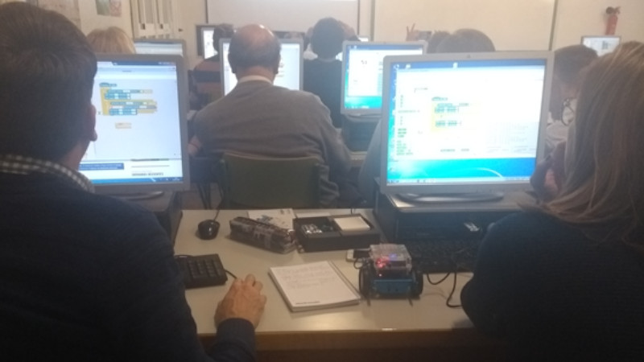

## Introducción

El siguiente curso presencial surge por la necesidad de aplicar nuevas metodologías utilizando la programación de videojuegos y aplicaciones como herramienta transversal para mejorar el aprendizaje en áreas de educación primaria y secundaria.

### Objetivos del curso

1. Conocer lenguajes de programación por bloques.
2. Gamificación en el aula para potenciar la motivación del alumnado.
3. Creación de recursos educativos multimedia mediante la programación.
4. Utilizar la programación como desarrollo hacia otras competencias.

 

## Pensamiento Computacional

El Pensamiento Computacional se define como el proceso por el cual nos enfrentamos a un problema aplicando habilidades propias de la computación y del pensamiento crítico. Dicho de otra forma, el pensamiento computacional implica resolver problemas cotidianos haciendo uso de los conceptos fundamentales de la programación informática para resolver problemas cuyas soluciones pueden ser representadas mediante una serie de pasos o instrucciones.

> El pensamiento computacional es un proceso mental utilizado para formular problemas cuyas soluciones pueden ser llevadas a cabo por un ordenador.

El pensamiento computacional implica un conjunto de técnicas y habilidades de resolución de problemas aplicados en los programas informáticos como la descomposición de problemas, abstracción de patrones, diseño de algoritmos, etc.

### Ejemplos de pensamiento computacional

En la mayoría de los talleres que realizamos proponemos a los asistentes que realicen una receta siguiendo unos pasos o instrucciones. Esto sería un ejemplo de aplicar el pensamiento computacional. Por ejemplo, supongamos que queremos realizar un Risotto utilizando un sobre de comida preparada (para que sea más rápido). En este caso los pasos serían los siguientes:

- Abrir el sobre
- Poner a calentar el agua
- Esperar a que el agua hierva
- Si hierve, verter el sobre
- Remover el contenido de la olla
- Apagar el fuego y dejar reposar
- Servir en el plato para "x" personas

Si el anterior algoritmo lo representamos utilizando un lenguaje de programación por bloques como Scratch, el resultado podría ser el siguiente:

 

## Programar sin ordenador

Una de las actividades que se puede realizar para desarrollar el pensamiento computacional consiste en trabajar la programación sin ordenador, actividades ideales para ir adquiriendo ciertas destrezas del mundo de la programación.

Un ejemplo de actividad consiste en utilizar movimientos como si de un brazo robótico se tratase, para formar una escultura utilizando vasos de plástico. Dicha actividad está sacada de "My Robotic Friends" publicada por la Computer Science Education Week 2013.

> Desde la web del proyecto <a target="_blank" href="https://csunplugged.org/es/">csunplugged</a>, encontrarás decenas de actividades.

Las instrucciones son muy sencillas; coger y soltar vaso, avanzar o retroceder brazo y girar 90º hacia la derecha o izquierda. En la siguiente imagen puedes ver que cada desplazamiento corresponde a una flecha.

La actividad que se suele proponer es en grupos de cuatro personas, donde una pareja actúa como programador y la otra pareja como robot. Mientras los programadores están realizando la estructura e instrucciones de programación mediante flechas, la otra pareja sale de la clase para no ver el resultado final. Una vez los programadores han realizado la estructura, los robots deberán seguir las instrucciones programadas para crear la estructura. Si los programadores han realizado bien el trabajo, y los robots han seguido las instrucciones de forma correcta, el resultado de la escultura debe ser la que programaron los robots.

El ISDI colabora con la Fundación Creáte en The Hour Of Code, en un taller de coding sin ordenador para los alumnos de primero y tercero de primaria del Colegio San Diego y San Vicente de Madrid.

  <iframe src="//www.youtube.com/embed/l7FwWt16IY4" allowfullscreen></iframe>

 

## Plataforma Code.org

Code.org es una organización sin fines de lucro, fundada por los hermanos Hadi y Ali Partovi, que tiene como objetivo incentivar a la gente, en especial a los estudiantes de colegios a aprender sobre las Ciencias Computacionales. Esta organización se encarga de dar lecciones gratis de programación, a través de su sitio web.

Esta herramienta es la preferida por muchos de los docentes interesados en introducir la programación en el aula ya que gracias a su asistente interactivo proporciona a los alumnos un aprendizaje guiado y cada uno puede programar a su ritmo. Además, el profesor puede desempeñar el rol de mentor para guiar a sus alumnos en los pasos de la programación. Es interesante crear una cuenta como profesor y administrar el aula con los alumnos, así puedes ver en tiempo real el progreso de los mismos y ver los ejercicios realizados, los ejercicios en los cuales tienen dudas, etc.

Dentro de la Hora del Código se pueden encontrar numerosos proyectos educativos con el mismo objetivo de acercar la programación desde edades tempranas y para todos los niveles.

> Puedes acceder a todos los proyectos desde la web de <a target="_blank" href="https://hourofcode.com/es/learn">HourOfCode.org</a>.

 

## ¿Qué es Scratch?

Scratch es un entorno gráfico de programación desarrollado por un grupo de investigadores del Lifelong Kindergarten Group del Laboratorio de Medios del MIT, bajo la dirección del Dr. Mitchel Resnick. Este entorno gráfico hace que la programación sea más atractiva y accesible para todo aquel que se enfrenta por primera vez a aprender un lenguaje de programación. Según sus creadores, fue diseñado como medio de expresión para ayudar a niños y jóvenes a expresar sus ideas de forma creativa, al tiempo que desarrollan habilidades de pensamiento lógico.

La aplicación de los lenguajes de programación por bloques permite una presentación visual del paradigma y metodología de la programación informática permitiendo centrarse en la lógica de la programación dejando a un lado la sintaxis propia de los lenguajes de programación (puntos y comas, paréntesis, etc).

### Videojuegos con Scratch

Scratch está disponible en su versión online y su versión offline, siendo esta última multiplataforma, es decir, podemos instalar Scratch en nuestro sistema operativo de Windows, Linux o MAC. Por otro lado, la ventaja que tiene la versión online es que todos los proyectos o videojuegos realizados quedan almacenados en la nube pudiendo acceder desde cualquier ordenador. Lo único que necesitas es registrarte y confirmar la cuenta para poder compartir los proyectos con el resto de compañeros.

En la siguiente imagen se muestra Scratch en su versión online desde el navegador Chrome, y Scratch offline instalado sobre un ordenador MAC.

> Puedes acceder a nuestros <a target="_blank" href="https://www.programoergosum.com/cursos-online/scratch">tutoriales</a> de programación con Scratch.

 

## Exposición de trabajos

A continuación aparecen los proyectos realizados por los docentes que han participado en el curso de formación.

### Proyecto Bee-Bot en lengua y matemáticas

> Este proyecto ha sido realizado por Alberto Campos, maestro del CEIP San José de Fuente Álamo (Murcia), dirigido a un grupo de 24 alumnos, de primer curso de Primaria. Se han realizado 2 actividades, una de Lengua y otra de Matemáticas.

La actividad de Lengua consiste en juntar sílabas, distribuidas por el tablero de Beebot, para formar palabras. El profesor escribirá en la pizarra 2 sílabas, y los alumnos deberán programar la Beebot para llegar a ellas y encontrar una palabra. En el tablero se marca la casilla de salida, desde donde partirá el robot, y los alumnos diseñarán 2 recorridos para alcanzar los cuadros donde se encuentran las sílabas pedidas. Estos alumnos están organizados en grupos, por lo que deberán descubrir y decidir entre todos un recorrido correcto. Se les reparten unas fichas de trabajo con el tablero dibujado, donde podrán realizar varios intentos para escribir los movimientos que seguirá la abeja, representada en un papel.

La segunda actividad, consiste en adivinar el resultado de una suma o de una resta, que el profesor escribirá en la pizarra. Cuando tengan el resultado correcto, deberán programar la Beebot para llegar al número exacto. Como premio final, los grupos que acierten, podrán programar la Beebot en el tablero.

Las 2 actividades han tenido mucho éxito y aceptación entre los alumnos. Realmente, el robot les llama mucho la atención por su carácter lúdico, por lo que la mayoría se esfuerza en programar correctamente a la Beebot para que llegue a los objetivos pedidos.

Algunas dificultades encontradas son, la escasa orientación espacial que presentan algunos alumnos a estas edades, la lateralidad no está consolidada y los conceptos derecha e izquierda no los tienen claros. También les resulta complicado tomar decisiones en grupo, porque todos quieren escribir, dirigir la abeja y que les hagan caso en lo que dicen.

### Proyecto Plickers en sociales y naturales

> Este proyecto ha sido realizado por Antonio Ludeña, maestro del CEIP Fernández Caballero de Murcia.

Una opinión extendida es que estos lenguajes requieren de profundos conocimientos informáticos y por tanto de un lenguaje profesional poco atractivo y comprensible para usuarios informáticos con escasos o nulos niveles de conocimiento en esta materia. Por tanto, en este documento final quiero reflejar mi satisfacción al haber comprendido que, a través del modelo basado en la programación por bloques, se hace cierta la manifestación expresada en el programa del curso, de que "permite a los programadores principiantes concentrarse en la lógica de la programación abstrayéndose de la gramática del propio lenguaje".

Se ha aplicado en el aula como mecanismo para refrescar contenidos de las áreas de Ciencias Sociales y Naturales, así como para la participación democrática en la toma de decisiones. En su uso se han introducido los nombres del alumnado y creado varias carpetas para ubicar los contenidos de cada una de las áreas.

La experiencia ha resultado muy positiva y en el futuro inmediato se trabajará con esta herramienta con los objetivos que a continuación se detallan:

- Motivación del alumnado con el uso de las nuevas tecnologías
- Mecanismo de elaboración de preguntas, por parte del alumnado, tipo test, con la consiguiente fijación y asimilación de contenidos.
- Pre evaluación diagnóstica del grado de adquisición de los contenidos propios de cada uno de los temas o proyectos de trabajo con los que se desarrolla la programación docente.
- Mecanismo de participación democrática en calidad de voto individual y parcialmente secreto, para la toma de decisiones grupales.
