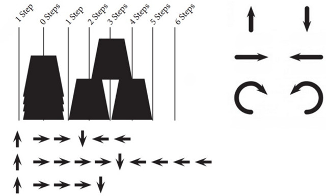
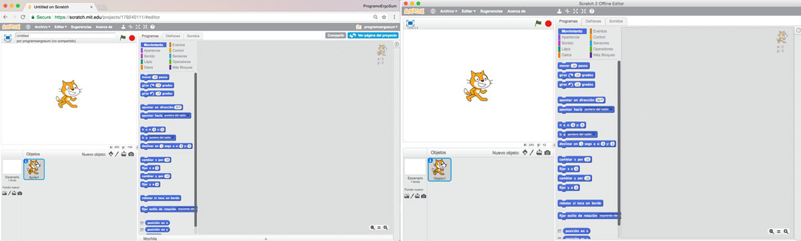

## Introducción

Las nuevas tendencias pedagógicas que se están desarrollando apuestan por la integración de las tecnologías del aprendizaje y el conocimiento en las aulas. A través de éstas el alumno es capaz de desarrollar sus propios aprendizajes, siendo el protagonista del proceso de enseñanza y aprendizaje.

Esta actividad, catalogada de nivel B1 permite adquirir y/o desarrollar las siguientes áreas competenciales dentro del **Marco Común de la Competencia Digital Docente**.

- Área 1. Información y alfabetización informacional
  - 1.3. Almacenamiento y recuperación de información, datos y contenidos digitales
- Área 3: Creación de contenido digital
  - 3.1. Desarrollo de contenidos digitales
  - 3.2. Integración y reelaboración de contenidos digitales
  - 3.3. Derechos de autor y licencias
- Área 5: Resolución de problemas
  - 5.2. Identificación de necesidades y respuestas tecnológicas
  - 5.3. Innovación y uso de la tecnología de forma creativa

### Objetivos del curso

1. Conocer lenguajes de *programación por bloques*.
2. *Gamificación* en el aula para potenciar la motivación del alumnado.
3. Creación de *recursos educativos multimedia* mediante la programación.
4. Utilizar la *programación* como desarrollo hacia otras competencias.

 

## Pensamiento computacional

El Pensamiento Computacional se define como el proceso por el cual nos enfrentamos a un problema aplicando habilidades propias de la computación y del pensamiento crítico. Dicho de otra forma, el pensamiento computacional implica resolver problemas cotidianos haciendo uso de los conceptos fundamentales de la programación informática para resolver problemas cuyas soluciones pueden ser representadas mediante una serie de pasos o instrucciones.

Una forma de desarrollar este tipo de aprendizaje es mediante Scratch, para ello iremos construyendo la programación de diferentes videojuegos paso a paso. Iremos incluyendo bloques partiendo de las necesidades más simples para completarlas según se necesiten.

> Accede a la entrada de nuestro blog donde explicamos qué es el <a href="https://www.programoergosum.es/blog/pensamiento-computacional-con-scratch/">pensamiento computacional</a>.

La lógica y el razonamiento de cada persona es diferente y esto hace que no solo haya una forma correcta de programar, sino que podríamos decir que tenemos tantas formas correctas como personas hayan dado con una de las posibles soluciones a un problema. Aunque también es cierto que tendremos soluciones más simples que otras, o que funcionen mejor. Y esto también es un aspecto a valorar y a tener en cuenta en cuanto a una posible evaluación de una buena estructura de programación.

### Herramientas de programación

Para el desarrollo del pensamiento computacional apostamos por los lenguajes de programación visuales o por bloques como <a target="_blank" href="https://developers.google.com/blockly/">Blockly</a> o <a target="_blank" href="https://scratch.mit.edu">Scratch</a> y diferentes proyectos educativos alojados en <a target="_blank" href="https://code.org/">code.org</a>.

 

## Programar sin ordenador

Actualmente podemos encontrar numerosas actividades para desarrollar el pensamiento computacional sin utilizar un ordenador. Actividades que no dependen del uso de ordenadores y así poder evitar la confusión entre la informática y la programación o el aprendizaje de programas de aplicaciones.

Estas actividades de programación desconectada tienden a permitir que los alumnos descubran las respuestas por sí mismos, en lugar de darles soluciones o algoritmos que seguir, es decir, se fomenta un enfoque constructivista ya que queremos que los alumnos se den cuenta de que son capaces de encontrar soluciones a los problemas por su cuenta, en vez de darles una solución al problema.

> Accede a la entrada de nuestro blog donde explicamos cómo <a href="https://www.programoergosum.es/blog/aprender-a-programar-sin-ordenador/">programar sin ordenador</a>.

 

## Plataforma Code.org

Code.org es una organización sin fines de lucro, fundada por los hermanos Hadi y Ali Partovi, que tiene como objetivo incentivar a la gente, en especial a los estudiantes de colegios a aprender sobre las Ciencias Computacionales. Esta organización se encarga de dar lecciones gratis de programación, a través de su sitio web.

Esta herramienta es la preferida por muchos de los docentes interesados en introducir la programación en el aula ya que gracias a su asistente interactivo proporciona a los alumnos un aprendizaje guiado y cada uno puede programar a su ritmo. Además, el profesor puede desempeñar el rol de mentor para guiar a sus alumnos en los pasos de la programación. Es interesante crear una cuenta como profesor y administrar el aula con los alumnos, así puedes ver en tiempo real el progreso de los mismos y ver los ejercicios realizados, los ejercicios en los cuales tienen dudas, etc.

Dentro de la Hora del Código se pueden encontrar numerosos proyectos educativos con el mismo objetivo de acercar la programación desde edades tempranas y para todos los niveles.

> Puedes acceder a todos los proyectos desde la web de <a target="_blank" href="https://hourofcode.com/es/learn">HourOfCode.org</a>.

 

## Videojuegos con Scratch

La aplicación de los lenguajes de programación por bloques permite una presentación visual del paradigma y metodología de la programación informática permitiendo centrarse en la lógica de la programación dejando a un lado la sintaxis propia de los lenguajes de programación (puntos y comas, paréntesis, etc).

Scratch está disponible en su versión online y su versión offline, siendo esta última multiplataforma, es decir, podemos instalar Scratch en nuestro sistema operativo de Windows, Linux o MAC. Por otro lado, la ventaja que tiene la versión online es que todos los proyectos o videojuegos realizados quedan almacenados en la nube pudiendo acceder desde cualquier ordenador. Lo único que necesitas es registrarte y confirmar la cuenta para poder compartir los proyectos con el resto de compañeros.

> Puedes acceder a nuestros <a target="_blank" href="https://www.programoergosum.com/cursos-online/scratch">tutoriales</a> de programación con Scratch.

 

## Exposición de trabajos

A continuación aparecen los proyectos realizados por los docentes que han participado en las ediciones anteriores del curso de formación permanente del profesorado en el Centro de Profesorado y Recursos de la Regiónj de Murcia.

### Proyecto Bee-Bot en lengua y matemáticas

> Este proyecto ha sido realizado por Alberto Campos, maestro del CEIP San José de Fuente Álamo (Murcia), dirigido a un grupo de 24 alumnos, de primer curso de Primaria. 

Se han realizado 2 actividades, una de Lengua y otra de Matemáticas. 

La actividad de Lengua consiste en juntar sílabas, distribuidas por el tablero de Beebot, para formar palabras. El profesor escribirá en la pizarra 2 sílabas, y los alumnos deberán programar la Beebot para llegar a ellas y encontrar una palabra. En el tablero se marca la casilla de salida, desde donde partirá el robot, y los alumnos diseñarán 2 recorridos para alcanzar los cuadros donde se encuentran las sílabas pedidas. Estos alumnos están organizados en grupos, por lo que deberán descubrir y decidir entre todos un recorrido correcto. Se les reparten unas fichas de trabajo con el tablero dibujado, donde podrán realizar varios intentos para escribir los movimientos que seguirá la abeja, representada en un papel.

La segunda actividad, consiste en adivinar el resultado de una suma o de una resta, que el profesor escribirá en la pizarra. Cuando tengan el resultado correcto, deberán programar la Beebot para llegar al número exacto. Como premio final, los grupos que acierten, podrán programar la Beebot en el tablero.

Las 2 actividades han tenido mucho éxito y aceptación entre los alumnos. Realmente, el robot les llama mucho la atención por su carácter lúdico, por lo que la mayoría se esfuerza en programar correctamente a la Beebot para que llegue a los objetivos pedidos.

Algunas dificultades encontradas son, la escasa orientación espacial que presentan algunos alumnos a estas edades, la lateralidad no está consolidada y los conceptos derecha e izquierda no los tienen claros. También les resulta complicado tomar decisiones en grupo, porque todos quieren escribir, dirigir la abeja y que les hagan caso en lo que dicen.

### Proyecto Plickers en sociales y naturales

> Este proyecto ha sido realizado por Antonio Ludeña, maestro del CEIP Fernández Caballero de Murcia.

Una opinión extendida es que estos lenguajes requieren de profundos conocimientos informáticos y por tanto de un lenguaje profesional poco atractivo y comprensible para usuarios informáticos con escasos o nulos niveles de conocimiento en esta materia. Por tanto, en este documento final quiero reflejar mi satisfacción al haber comprendido que, a través del modelo basado en la programación por bloques, se hace cierta la manifestación expresada en el programa del curso, de que "permite a los programadores principiantes concentrarse en la lógica de la programación abstrayéndose de la gramática del propio lenguaje".

Se ha aplicado en el aula como mecanismo para refrescar contenidos de las áreas de Ciencias Sociales y Naturales, así como para la participación democrática en la toma de decisiones. En su uso se han introducido los nombres del alumnado y creado varias carpetas para ubicar los contenidos de cada una de las áreas.

La experiencia ha resultado muy positiva y en el futuro inmediato se trabajará con esta herramienta con los objetivos que a continuación se detallan:

- Motivación del alumnado con el uso de las nuevas tecnologías
- Mecanismo de elaboración de preguntas, por parte del alumnado, tipo test, con la consiguiente fijación y asimilación de contenidos.
- Pre evaluación diagnóstica del grado de adquisición de los contenidos propios de cada uno de los temas o proyectos de trabajo con los que se desarrolla la programación docente.
- Mecanismo de participación democrática en calidad de voto individual y parcialmente secreto, para la toma de decisiones grupales.

 

## Materiales

- <a target="_blank" href="https://classic.csunplugged.org/books/">Libro de actividades de programación sin ordenador</a>

 

## Enlaces de interés

- <a href="https://www.programoergosum.es/blog/pensamiento-computacional-con-scratch/" title="Pensamiento computacional con Scratch">Pensamiento computacional con Scratch</a>.
- <a href="https://www.programoergosum.es/blog/aprender-a-programar-sin-ordenador/" title="Aprender a programar sin ordenador">Aprender a programar sin ordenador</a>.
- <a target="_blank" href="https://www.programoergosum.com/cursos-online/scratch">Tutoriales de programación con Scratch</a>
- <a target="_blank" href="https://www.programoergosum.com/cursos-online/robotica-educativa">Tutoriales de Robótica Educativa</a>
