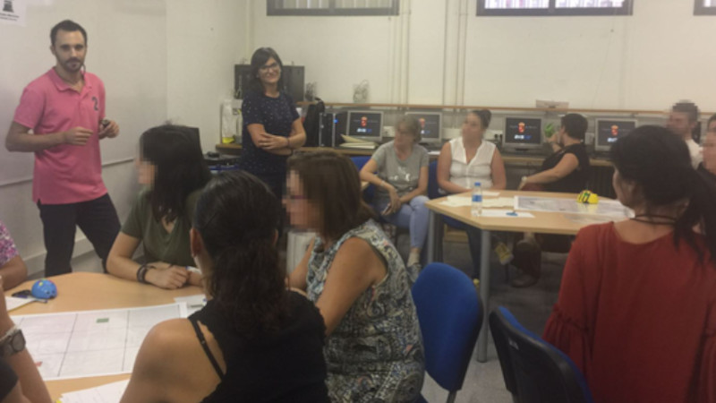
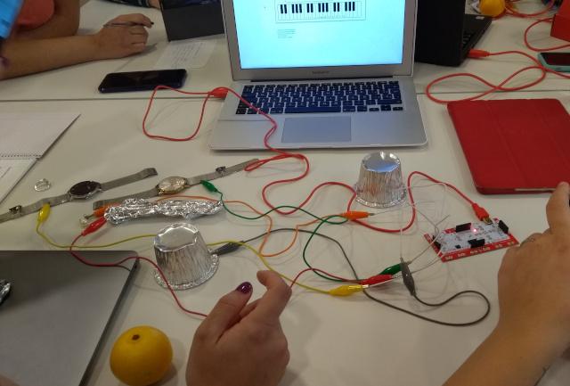
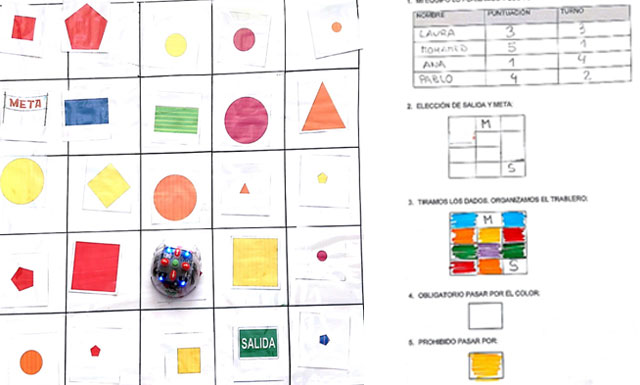

## Introducción

El siguiente curso presencial surge por la necesidad de aplicar nuevas metodologías en la integración de niños y niñas con diversidad funcional (TEA, TDA, TDAH, etc.). Utilizando la robótica educativa y la gamificación podemos desarrollar diferentes tipos de habilidades, como la habilidad visual, musical, corporal, lógica o verbal entre otras.

### Objetivos del curso

1. Dar a conocer diferentes entornos de programación y robótica destinados a la integración de niños con necesidades educativas especiales en el aula.
2. Utilizar técnicas de gamificación en el aula, para mejorar el proceso de enseñanza-aprendizaje y potenciar la motivación del alumno.
3. Conocer las posibilidades que ofrece la realidad aumentada para su aplicación en el aula.

 

## Habilidad visual

En la actualidad existe una gran cantidad de videojuegos educativos. En este curso se han presentado y explicado tres videojuegos educativos muy sencillos destinados a niños de educación infantil, primaria e incluso un videojuego un poco más avanzado que podría usarse hasta en secundaria.

Además se ha explicado las ventajas e incovenientes que tienen cada uno y se ha puesto en práctica por los docentes para sacar conclusiones de primera mano y poder debatirlas en grupo.

> Puedes acceder a todos los proyectos desde la web de [HourOfCode.org](https://hourofcode.com/es/learn).

 

## Habilidad verbal

El primer paso es adquirir conocimientos básicos sobre la programación de historias y videojuegos con Scratch. Utilizando una pequeña parte de los bloques, podemos crear diferentes historias y animaciones para ayudar a nuestros alumnos en ciertas áreas, por ejemplo, a la hora de explicar el ciclo del agua mediante animaciones, contar cuentos, etc.

> Con Scratch se pueden contar cuentos e historias interactivas.

Para crear tu propio videojuego con Scratch te recomiendo seguir una serie de pautas. La primera de ellas será crear en el escenario de Scratch la asignación de personajes con llamadas a eventos, y en cada personaje programar su ejecución. Accede a la [animación](https://scratch.mit.edu/projects/146318820/) en Scratch para entender el concepto y completar el cuento de caperucita roja.

 

## Habilidad musical

Makey-Makey es una placa similar al mando de una videoconsola que simula ser un teclado normal o ratón, lo que permite enviar ordenes al ordenador al que se encuentre conectado. En vez de pulsar los botones lo que hacemos es cerrar el circuito mediante contactos o pinzas de cocodrilo y de esta forma simula el haber pulsado el botón.

> Los docentes asistentes al curso practican el uso de placas Makey - Makey sobre diferentes materias.

 

## Exposición de trabajos

A continuación aparecen los proyectos realizados por los docentes que han participado en el curso de formación.

### Proyectos utilizando robots de suelo

Este proyecto utilizando Blue-Bot ha sido realizado por Celia y María Nieves, maestra del CEIP Pedro Pérez Abadía, Espinardo (Murcia). Para ello realizaron un tablero utilizando cartulinas y recortes. La actividad consistía en llegar al tesoro habiendo recogido por el camino la suma del número indicado. Realizaron varias niveles ya que primero se practicaba sin números y cuando los alumnos controlaban el robot añadieron los números a la actividad.

Otro proyecto utilizando Blue-Bot ha sido realizado por Aurora, maestra del CEIP Stella Maris, Cartagena (Murcia). En este caso está destinado al alumnado con TDAH en infantil y primaria para las competencias básicas de matemáticas, ciencias, tecnología, sociales - cívicas y lingüísticas.

Similar a los anteriores, otro proyecto utilizando Bee-Bot ha sido realizado por María Isabel, maestra PT del CEIP San Roque, Ceutí (Murcia). Su objetivo era desarrollar las funciones ejecutivas como la planificación, autocontrol, lateralidad, memoria de trabajo, inhibición y toma de deciciones. Para ello creó un tablero utilizando palitos de los helados de colores.

Además de BeeBot, Ana, maestra en Murcia, nos ha presentado su proyecto utilizando el robot Next de Edelvives. Además nos ha explicado que es muy parecido al robot visto en el curso en cuanto a funcionalidad y desplazamientos. En su caso utilizó una actividad de perseguir el cofre del tesoro la cual le resultó muy motivadora en niños con 4 y 5 años.

### Proyectos utilizando programación

Este proyecto utilizando la plataforma de code.org ha sido realizado por Leonor y Begoña, maestra y PT del CEIP Luis Vives, Albujón (Murcia). Para ello, registró a todos los alumnos asignándole una contraseña personal. Les explicó detalladamente en clase la forma de acceder a sus cuentas personales para ir accediendo a los diferentes juegos. Por último se llevó a cabo la experiencia con todo el alumnado a la vez, contando con el apoyo de la maestra de PT para el trabajo con los niños que demandan mayor atención como son los niños con síndrome de Down, hiperactividad y niños con implante coclear.

Este proyecto utilizando Realidad Aumentada y Scratch ha sido realizado por Judit, maestra PT del CEIP Obispos García-Ródenas de Bullas (Murcia). Durante la exposición del proyecto nos cuenta que, partiendo del centro de interés del alumno, las motos, y con el objetivo de trabajar la discriminación entre el color verde y azul, ha elaborado un juego en el que el alumno debe tocar las motos de acuerdo a la instrucción dada. Además añade que es muy motivador para el alumno porque favorece el aprendizaje autónomo, permite el desarrollo de los procesos de pensamiento y habilidades mentales en el alumno. Sin embargo, el programa es un poco complicado de manejar, en cuanto a programación, por parte del docente.

Otro proyecto utilizando Scratch ha sido realizado por Lidia, maestra del CEIP San José, Lorca (Murcia). En este caso está destinado al alumnado con TDAH para ayudarles a identificar las sílabas de diferentes palabras. Para ello se muestra un animalito y a continuación aparecen varias opciones que al acertar aparece un sonido con aplausos y si no aciertas te deja que vuelvas a intentarlo mostrando un sonido diferente.

Fuensanta, maestra de primaria, realiza el proyecto de pasapalabra con Scratch destinado a las unidades del sistema solar, para que sus alumnos puedan repasar estos conocimientos de forma diferente. Puedes acceder al pasapalabra desde el siguiente link. Por otro lado, Baltasar también realizó un proyecto de pasapalabra con Scratch.

### Proyectos utilizando makey-makey

Este proyecto utilizando Makey-Makey con Scratch ha sido realizado por Alfonso y Francisco, maestros del CEIP Divino Maestro de Las Torres de Cotillas (Murcia). Para ello repartieron las acciones entre los diferentes cursos de primaria de la siguiente forma; tercero de primaria ha realizado los dibujos de los diferentes árboles del huerto: limonero, naranjo, ciruelo, peral. Cuarto ha realizado adivinanzas y definiciones de los diferentes árboles. Quinto y sexto ha realizado un scratch para cada ciclo de primaria e infantil. Han recopilado información de cada árbol y la han adaptado a cada ciclo. Han realizado un documento con la información. Han hecho la grabación atendiendo a la edad. Han confeccionado el programa con Scratch. Todos los alumnos desde infantil a sexto han ido pasando por el huerto y cuando tocaban el cartel con la definición o el dibujo del árbol sonaba la voz en off que habían grabado los alumnos de 5º y 6º.

### Proyectos utilizando realidad aumentada

Este proyecto utilizando Realidad Aumentada ha sido realizado por Álvaro, maestro del CEIP Vicente Alexandre de Fortuna (Murcia). Durante la exposición del proyecto nos cuenta que, Toy Car Rc es una App de realidad aumentada para dispositivos iOS que permite a los alumnos experimentar una simulación interactiva de conducir un coche virtual controlado por control remoto a través del mundo real. Para poder trabajar con Toy Cr RC se requiere una Tablet y blancos (láminas de dibujos para crear la realidad aumentada) que se pueden imprimir de forma gratuita y predefinida en la aplicación o se pueden crear al tomar fotografías con la cámara del dispositivo. Una vez colocados los blancos en el suelo, por equipos, los niños/ as pueden trabajar la orientación espacial y las nociones espaciales sencillas (arriba/ abajo, derecha, izquierda, delante, detrás) a través de la motivación que suponen las nuevas tecnologías.

Similar al anterior, Nuria, Maestra PT del CPEE Ascruz de Las Torres de Cotillas (Murcia) nos presenta su proyecto de Realidad Aumentada destinado a alumnos de infantil, primaria y con necesidades educativas especiales. Los objetivos son conocer el vocabulario de la unidad didáctica los animales y desarrollar nociones espaciales sencillas. Las apps utilizadas son gratuitas y han sido utilizadas desde dispositivos iOS.

