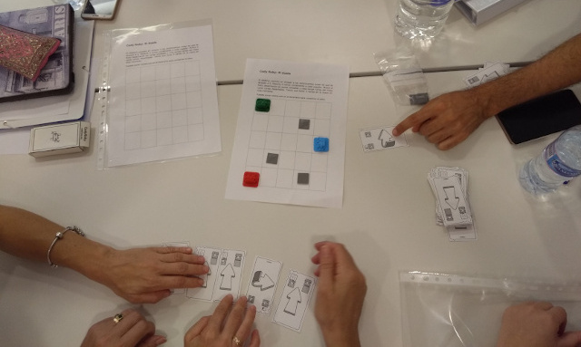
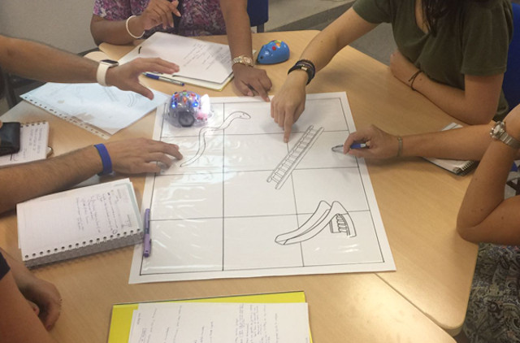
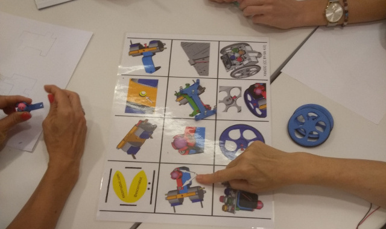
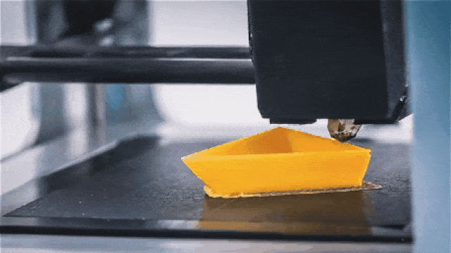
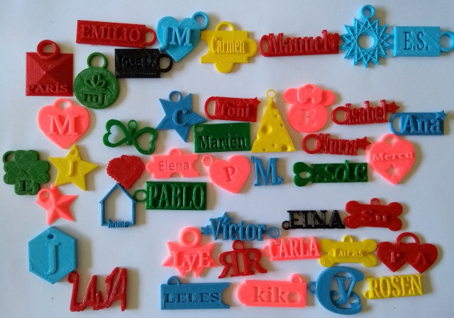
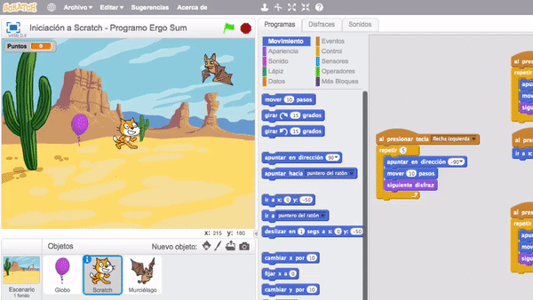
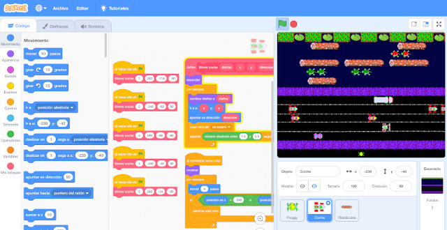
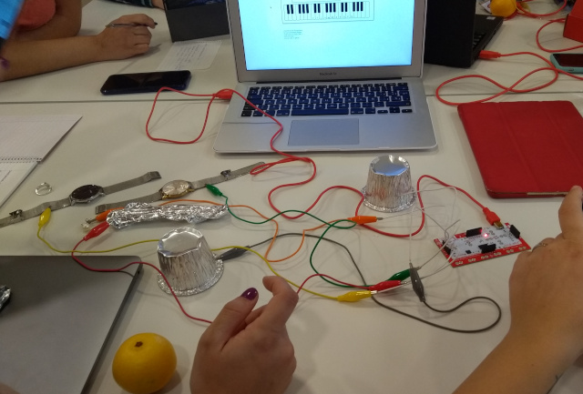

## Programar sin ordenador

Son numerosas las páginas, programas o robots pensados para el desarrollo del pensamiento computacional desde edades tempranas. Sin embargo, también podemos encontrar actividades para aprender a programar sin necesidad de utilizar un ordenador o dispositivo informático, lo que se conoce como *programación desenchufada o desconectada*.

> Accede al artículo donde explicamos algunas actividades para [aprender a programar sin ordenador](https://www.programoergosum.es/blog/aprender-a-programar-sin-ordenador/).

Durante esta sesión del curso, destinada a la **introducción al pensamiento computacional**, probamos diferentes actividades relacionadas con el aprendizaje de la programación, utilizando material comúnmente encontrado en las aulas de educación infantil y primaria.

Este tipo de actividades desconectadas son ideales para ir adquiriendo ciertas destrezas en el mundo de la programación informática y la robótica educativa ya que los alumnos descubren las respuestas a los problemas por sí mismos fomentando un enfoque constructivista.

<!--

-->

Además, con un poco de imaginación se pueden crear diferentes juegos educativos para fomentar la lógica computacional. Juegos basados en programas como Scratch Jr. creado utilizando piezas impresas en 3D pero que perfectamente podrían haber sido creadas utilizando otro tipo de materiales como cartón pluma o goma eva entre otros muchos materiales.

<!--

-->

 

## Robots educativos de suelo

Aunque el robot educativo de suelo más conocido suele ser la famosa abeja *Beebot*, podemos encontrar otros robots de características muy similares para utilizar en el aula con nuestros alumnos, como es el caso de *Next*, *Mouse* o el proyecto *Escornabot*, entre muchos otros.

> Accede al artículo donde realizamos una comparativa sobre los diferentes [robots educativos de suelo](https://www.programoergosum.es/blog/robots-educativos-de-suelo/).

Durante esta sesión del curso, destinada a la **introducción al pensamiento computacional**, probamos diferentes robots educativos para que sean los propios docentes los que las tomen conclusiones de primera mano.

> Para más información puedes acceder a nuestro tutorial de [Introducción a la robótica educativa con Bee-Bot](https://www.programoergosum.es/tutoriales/robotica-educativa-con-beebot).

El robot de suelo que solemos recomendar es *Escornabot*. Lo que lo hace especial es la filosofía de proyecto de código y hardware abierto que sigue, además de la ámplia comunidad educativa que puedes encontrar en sus redes sociales.

Como prodrás observar, este robot no suele encontrarse en tiendas ya que el objetivo del proyecto es que seas tú mismo el que lo construye y lo monta comprando los materiales de electrónica e imprimiendo los modelos de las piezas con una impresora 3D.

> Para más información puedes acceder a nuestro tutorial de [Introducción a la robótica educativa con Escornabot](https://www.programoergosum.es/tutoriales/robotica-educativa-con-escornabot).

En este curso los docentes aprenden las partes principales del robot Escornabot en su versión [2.12 Xdesig](https://www.thingiverse.com/thing:3269696) al mismo tiempo que lo montan.

 

## La Hora del Código

La Hora del Código es una iniciativa que tiene como objetivo incentivar a los estudiantes a aprender sobre las Ciencias Computacionales. Es una de las iniciativas preferidas por muchos de los docentes interesados en introducir la programación en el aula ya que disponene de numerosos materiales con asistentes interactivos para un aprendizaje guiado.

Podemos acceder al apartado de [actividades](https://hourofcode.com/es/learn) donde encontraremos una gran cantidad de proyectos educativos destinados a la enseñanza de la programación en las escuelas e institutos. Como se puede observr en la siguiente imagen, en cada una de las actividades aparece el nombre del proyecto, una pequeña descripción, las características técnicas y la edad recomendada de la actividad.

 

## Plataforma Code.org

[Code.org](https://code.org/) es la plataforma perfecta para aprender la lógica de la programación a través de los lenguajes de programación por bloques. Con sus asistente guiado no es necesario tener conocimientos con lo que se puede utilizar en el aula desde educación infantil.

> Accede al artículo donde explicamos como puedes [aprender a programar en La Hora del Código](https://www.programoergosum.es/blog/aprender-a-programar-con-la-hora-del-codigo).

Para los docentes, se incluye un apartado acompañado de una documentación muy completa con soluciones a los ejercicios. Para ello hay que crear una cuenta como docente. Una vez creada la cuenta de profesor podemos crear gurpos de alumnos o aulas virtuales para ver y revisar el progreso de nuestros alumnos.

Durante esta sesión del curso, destinada a la **introducción a los lenguajes de programación**, probamos diferentes cursos y lecciones de la plataforma para aprender a programar con el lenguaje de programación por bloques.

 

## Maker e Impresión 3D

La impresión 3D está empezando a utilizarse en los centros educativos. Es así porque profesores se han dado cuenta del valor de la impresora 3D como una herramienta para enseñar a la próxima generación de inventores.

Aunque parezca cosa solo de ingenieros, son muchos los tipos de impresoras que podemos encontrar para iniciarse en este maravilloso mundo del movimiento maker en educación. Una de las más conocidas en el ámbito educativo es la impresora *Da Vinci* por su sencillez en el uso así como por su precio. Aunque hay quienes prefieren hacerse con una impresora más profesional y potente para sacarle el máximo partido.

Por otro lado, en cuanto al software utilizado, podemos diseñar piezas con programas preparados para utilizarse con jóvenes, como es el caso de [TinkerCAD](https://www.tinkercad.com/).

> Puedes acceder a nuestro tutorial donde explicamos cómo crear un [Llavero personalizado en TinkerCAD](https://www.programoergosum.es/tutoriales/llavero-personalizado-en-tinkercad).

El objetivo de usar TinkerCAD para iniciarse en el mundo de la impresión 3D es debido a su sencillez para realizar cualquier objeto en 3D arrastrando bloques y sin necesidad de utilizar funciones complejas como en programas más avanzados de diseño 3D.

<!--
### Llaveros realizados por docentes

- [IES Juan Carlos I](https://www.tinkercad.com/things/jq4ezQKv5Mb)
- [CEIP San José](https://www.tinkercad.com/things/5P19rT1mWZA)
- [CEIP Martínez Ardieta](https://www.tinkercad.com/things/kCaF4KgfTsk)
- [CEIP Hnos. S. Isidoro y Sta. Florentina](https://www.tinkercad.com/things/bhNu9jX7pov)
- [CEIP Ciudad del Mar](https://www.tinkercad.com/things/6ZXgi2K4nqA)
- [CEIP Purísima Concepción](https://www.tinkercad.com/things/jlT7RIKroAw)
- [CEIP Los Molinos](https://www.tinkercad.com/things/52vKYYGMUDc)
-->

 

## Programación con Scratch

Un lenguaje de programación por bloques tiene como característica principal centrarse en el desarrollo de habilidades mentales mediante el aprendizaje de la programación, sin tener conocimientos sobre el código escrito. Sus características están ligadas al fácil entendimiento del pensamiento lógico y computacional han hecho que sea muy difundido en la educación desde edades iniciales.

Estos lenguajes de programación se utiliza con fines didácticos para crear animaciones de forma sencilla y servir como introducción al contenido de programación más avanzado. Entre los principales lenguajes de programación por bloques tenemos a Scratch, Blockly o Snap.

> Accede a nuestros [tutoriales](https://www.programoergosum.es/tutoriales/tags/scratch/) para aprender a programar con Scratch.

Aunque Scratch parece una herramienta destinada solamente a niños, podemos asegurar que es una herramienta muy poderosa ya que se pueden explicar conceptos del paradigma de la [programación orientada a objetos con Scratch](https://www.programoergosum.es/tutoriales/programacion-orientada-a-objetos-con-scratch/) y entenderlo de forma sencilla como explicamos en el tutorial.

 

## Robótica con Makey-Makey

[Makey-Makey](https://makeymakey.com/) es una placa similar al mando de una videoconsola que simula ser un teclado o ratón, lo que permite enviar órdenes al ordenador al que se encuentre conectado.

Durante esta sesión del curso, destinada a la robótica educativa en educación infantil, probamos diferentes aplicaciones y usos de la Makey-Makey en el aula. Se puso en práctica la conductividad de los diferentes materiales que encontramos en el aula como medio de aprendizaje.

> Accede a nuestros [tutoriales](https://www.programoergosum.es/tutoriales/tags/makey-makey/) de robótica educativa utilizando la placa Makey-Makey.

Por otro lado, siguiendo el tutorial de fabricación de [plastilina conductora casera](https://www.programoergosum.es/tutoriales/manualidades-con-makey-makey/), se sacaron ideas de uso en el aula de infantil y primaria utilizando la placa Makey-Makey y programando un sencillo programa con sCratch para que los alumnos más pequeños aprendan las vocales de una forma divertida.

