## Robots educativos de suelo

Aunque el robot de suelo más conocido es la famosa abeja *Beebot*, a día de hoy podemos encontrar otros robots educativos con características similares para utilizar en el aula con nuestros alumnos.

> Para más información puedes acceder a nuestro tutorial de [Introducción a la robótica educativa con Bee-Bot](https://www.programoergosum.es/tutoriales/robotica-educativa-con-beebot).

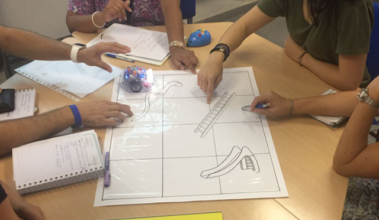

Durante esta sesión del curso, destinada a la **introducción al pensamiento computacional**, probamos diferentes robots educativos para que sean los propios docentes los que las tomen conclusiones de primera mano.

### Conclusiones de Nieves y Celia

Este proyecto utilizando Blue-Bot ha sido realizado por Celia y María Nieves. Crearon un tablero utilizando cartulinas y recortes. La actividad consistía en llegar al tesoro habiendo recogido por el camino la suma del número indicado. Realizaron varias niveles ya que primero se practicaba sin números y cuando los alumnos conocñian el manejo y uso del robot añadieron los números a la actividad.

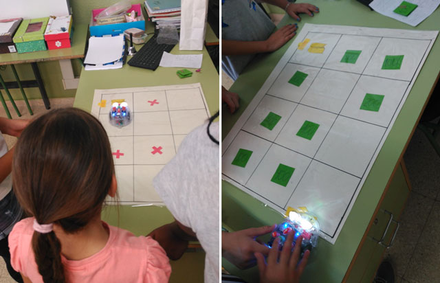

### Conclusión de Aurora

Otro proyecto utilizando Blue-Bot ha sido realizado por Aurora. En este caso está destinado al alumnado con TDAH en infantil y primaria para las competencias básicas de matemáticas, ciencias, tecnología, sociales - cívicas y lingüísticas.

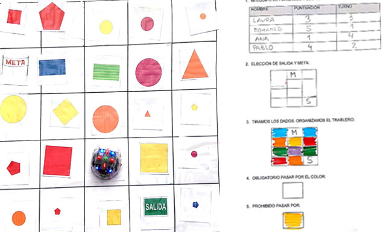

### Conclusión de María Isabel

Similar a los anteriores, otro proyecto utilizando Bee-Bot ha sido realizado por María Isabel. Su objetivo consistía en desarrollar las funciones ejecutivas como la planificación, autocontrol, lateralidad, memoria de trabajo, inhibición y toma de deciciones. Para ello creó un tablero utilizando palitos de los helados de colores.

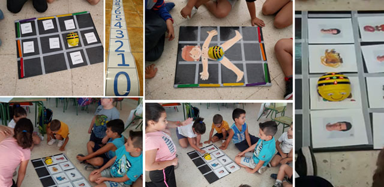

### Conclusión de Ana

Además de BeeBot, Ana, nos ha presentado su proyecto utilizando el robot Next de Edelvives. Además nos ha explicado que es muy parecido al robot visto en el curso en cuanto a funcionalidad y desplazamientos. En su caso utilizó una actividad de perseguir el cofre del tesoro la cual le resultó muy motivadora en niños con 4 y 5 años.

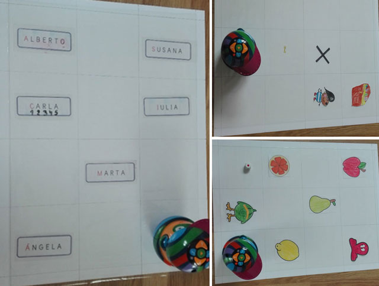

 

## Plataformas de programación

La Hora del Código es una iniciativa que tiene como objetivo incentivar a los estudiantes a aprender sobre las Ciencias Computacionales. Por otro lado contamos con la plataforma educativa [Code.org](https://code.org/), considerada la plataforma perfecta para aprender la lógica de la programación a través de los lenguajes de programación por bloques por varios maestros y maestras. Con sus asistente guiado no es necesario tener conocimientos con lo que se puede utilizar en el aula desde educación infantil.

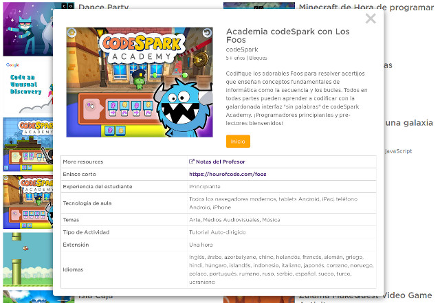

Estas plataformas de programación se utiliza con fines didácticos para crear animaciones de forma sencilla y servir como introducción al contenido de programación más avanzado. Entre los principales lenguajes de programación por bloques tenemos a Scratch.

### Conclusión de Leonor

Este proyecto utilizando la plataforma de code.org ha sido realizado por Leonor y Begoña. Registraron a todos los alumnos asignándole una contraseña personal. Se ses explicó detalladamente en clase la forma de acceder a sus cuentas personales para ir accediendo a los diferentes juegos. Por último se llevó a cabo la experiencia con todo el alumnado a la vez, contando con el apoyo de la maestra de PT para el trabajo con los niños que demandan mayor atención como son los niños con síndrome de Down, hiperactividad y niños con implante coclear.

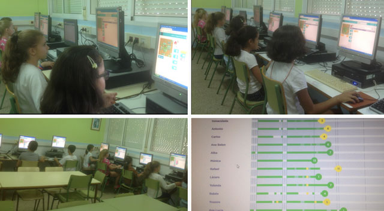

### Conclusión de Judit

Este proyecto utilizando Realidad Aumentada y Scratch ha sido realizado por Judit. Durante la exposición del proyecto nos cuenta que, partiendo del centro de interés del alumno, las motos, y con el objetivo de trabajar la discriminación entre el color verde y azul, ha elaborado un juego en el que el alumno debe tocar las motos de acuerdo a la instrucción dada. Además añade que es muy motivador para el alumno porque favorece el aprendizaje autónomo, permite el desarrollo de los procesos de pensamiento y habilidades mentales en el alumno. Sin embargo, el programa es un poco complicado de manejar, en cuanto a programación, por parte del docente.

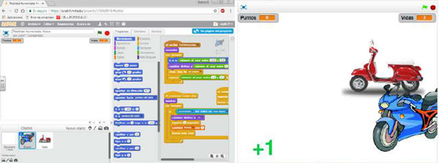

### Conclusión de Lidia

Otro proyecto utilizando Scratch ha sido realizado por Lidia. En este caso está destinado al alumnado con TDAH para ayudarles a identificar las sílabas de diferentes palabras. Para ello se muestra un animalito y a continuación aparecen varias opciones que al acertar aparece un sonido con aplausos y si no aciertas te deja que vuelvas a intentarlo mostrando un sonido diferente.

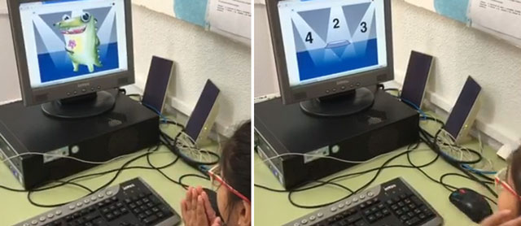

### Conclusión de Fuensanta

Fuensanta, realiza el proyecto de pasapalabra con Scratch destinado a las unidades del sistema solar, para que sus alumnos puedan repasar estos conocimientos de forma diferente. Puedes acceder al pasapalabra desde [aquí](https://scratch.mit.edu/projects/179269652/). Por otro lado, Baltasar también realizó un proyecto de pasapalabra con Scratch.

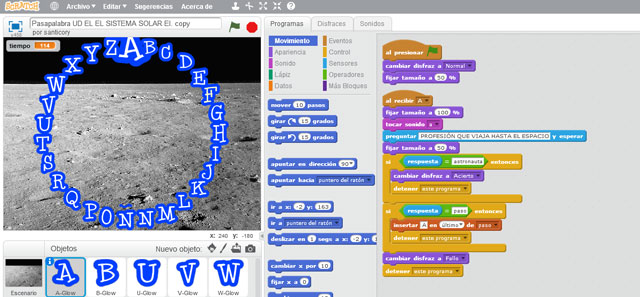

 

## Robótica con Makey-Makey

[Makey-Makey](https://makeymakey.com/) es una placa similar al mando de una videoconsola que simula ser un teclado normal o ratón, lo que permite enviar ordenes al ordenador al que se encuentre conectado. En vez de pulsar los botones lo que hacemos es cerrar el circuito mediante contactos o pinzas de cocodrilo y de esta forma simula el haber pulsado el botón.

Durante esta sesión del curso probamos diferentes aplicaciones y usos de la Makey-Makey en el aula. Se puso en práctica la conductividad de los diferentes materiales que encontramos en el aula como medio de aprendizaje.

### Conclusiones de Alfonso y Francisco

Este proyecto utilizando Makey-Makey con Scratch ha sido realizado por Alfonso y Francisco. Para ello repartieron las acciones entre los diferentes cursos de primaria de la siguiente forma:

Tercero de primaria ha realizado los dibujos de los diferentes árboles del huerto: limonero, naranjo, ciruelo, peral. Cuarto ha realizado adivinanzas y definiciones de los diferentes árboles.

Quinto y sexto ha realizado un scratch para cada ciclo de primaria e infantil. Han recopilado información de cada árbol y la han adaptado a cada ciclo. Han realizado un documento con la información. Han hecho la grabación atendiendo a la edad. Han confeccionado el programa con Scratch. 

Todos los alumnos desde infantil a sexto han ido pasando por el huerto y cuando tocaban el cartel con la definición o el dibujo del árbol sonaba la voz en off que habían grabado los alumnos de 5º y 6º.

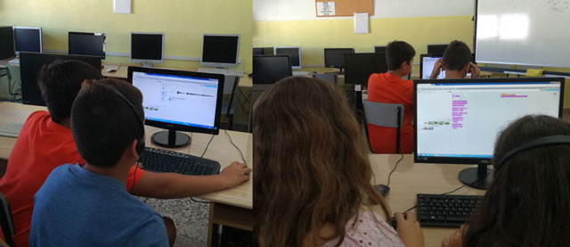

 

## Realidad aumentada

La realidad aumentada en educación es un proceso que permite observar elementos físicos de la realidad a través de dispositivos y software específico, aplicando la tecnología como recurso de enseñanza y aprendizaje.

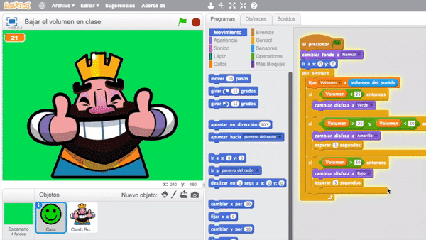

Durante esta sesión del curso probamos diferentes aplicaciones en el aula para que sean los propios docentes los que saquen conclusiones por ellos mismos.

### Conclusión de Álvaro

Este proyecto utilizando Realidad Aumentada ha sido realizado por Álvaro. Durante la exposición del proyecto nos cuenta que, Toy Car Rc es una App de realidad aumentada para dispositivos iOS que permite a los alumnos experimentar una simulación interactiva de conducir un coche virtual controlado por control remoto a través del mundo real. Para poder trabajar con Toy Cr RC se requiere una Tablet y blancos (láminas de dibujos para crear la realidad aumentada) que se pueden imprimir de forma gratuita y predefinida en la aplicación o se pueden crear al tomar fotografías con la cámara del dispositivo. Una vez colocados los blancos en el suelo, por equipos, los niños/ as pueden trabajar la orientación espacial y las nociones espaciales sencillas (arriba/ abajo, derecha, izquierda, delante, detrás) a través de la motivación que suponen las nuevas tecnologías.

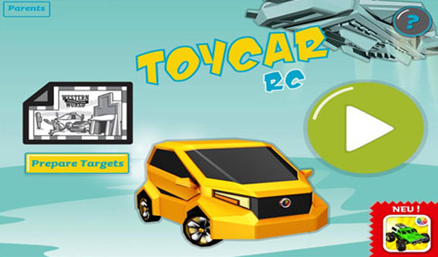

### Conclusión de Núria

Similar al anterior, Nuria, nos presenta su proyecto de Realidad Aumentada destinado a alumnos de infantil, primaria y con necesidades educativas especiales. Los objetivos son conocer el vocabulario de la unidad didáctica los animales y desarrollar nociones espaciales sencillas. Las apps utilizadas son gratuitas y han sido utilizadas desde dispositivos iOS.

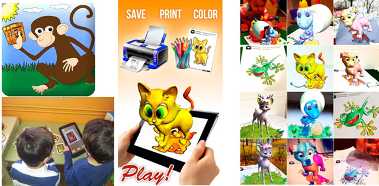
